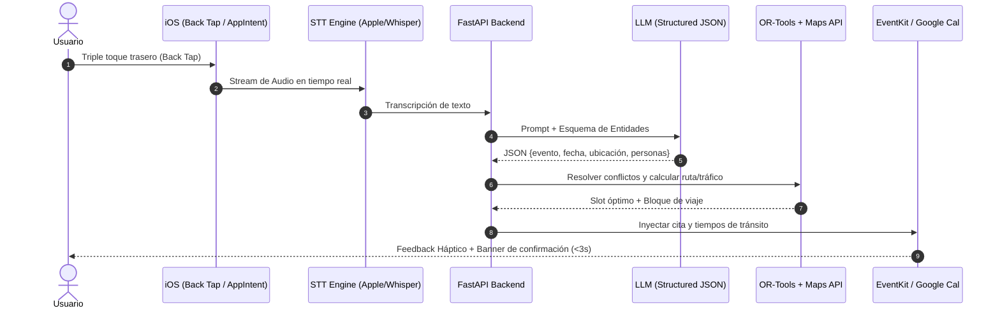

# Smart Scheduler AI ⏱️⚡

[](#)
[](#)
[](https://fastapi.tiangolo.com)
[](https://reactnative.dev)
[](https://nextjs.org)

**Smart Scheduler AI** es un asistente contextual de última generación diseñado para eliminar por completo la fricción operativa en la gestión de tiempo personal y profesional. Transforma intenciones expresadas por voz o texto en bloques de tiempo optimizados, calculando automáticamente traslados en tiempo real y negociando reuniones con terceros de forma desatendida.

---

## 🌟 Propuesta de Valor & Características Principales

* 🎙️ **Captura Ubicua y Sin Fricción:** Invocación instantánea mediante gestos del sistema (*Back Tap* o *Action Button* en iOS vía Native App Intents; *Quick Settings* / App Actions en Android) sin necesidad de abrir la aplicación.
* ⚡ **Procesamiento de Ultra Baja Latencia (<3.0s):** Pipeline híbrido de voz a texto (Apple Speech on-device con fallback a Whisper API) y modelos LLM ligeros con *Structured Outputs* (JSON Schema estricto).
* 🚗 **Orquestación Contextual Inteligente:** Motor de optimización CSP (*Constraint Satisfaction Problem* vía Google OR-Tools) que inserta automáticamente bloques de desplazamiento dinámicos usando Google Maps Distance Matrix / MapKit.
* 🤖 **Negociación Desatendida con Terceros:** Coordina y reserva espacios enviando 2 a 3 opciones óptimas por el canal preferido del destinatario (WhatsApp vía Meta Cloud API, SMS o Email) sin obligar a la otra persona a registrarse o instalar la app.
* 🔄 **Sincronización Multi-Calendario Bidireccional:** Integración transparente con Google Calendar v3, Microsoft Graph (Outlook) y calendarios locales vía EventKit.
* 🔒 **Seguridad y Privacidad Estricta:** Cifrado en tránsito (TLS 1.3) y en reposo (AES-256). Streaming de audio sin persistencia permanente en cumplimiento con GDPR y CCPA.

---

## 🏗️ Arquitectura del Sistema

```text
┌────────────────────────────────────────────────────────────────────────┐
│                        CLIENTES & INTERFACES                          │
├───────────────────────────────────┬────────────────────────────────────┤
│           Móvil (React Native/Expo)│       Web Portal (Next.js 14)      │
│  [Swift Bridge]   [Kotlin Bridge] │   - Confirmación rápida (URLs)     │
│  • App Intents     • Quick Settings│   - Panel de usuario & métricas    │
│  • Speech/EventKit • App Actions   │   - Tailwind CSS                   │
└─────────────────┬─────────────────┴──────────────────┬─────────────────┘
                  │                                    │
                  └────────────► HTTPS / WSS ◄─────────┘
                                       │
┌──────────────────────────────────────▼─────────────────────────────────┐
│                    BACKEND ORQUESTADOR (FastAPI / Python)              │
├────────────────────────────────────────────────────────────────────────┤
│  • Pipelines Asíncronos & Autenticación OAuth                          │
│  • Motor CSP (Google OR-Tools): Cálculo de restricciones y holguras    │
│  • Integración IA: Apple Speech / OpenAI Whisper + Gemini / GPT        │
│  • Webhooks Engine (Meta Cloud API, Resend, Twilio)                    │
└──────────────────┬───────────────────────────────────┬─────────────────┘
                   │                                   │
┌──────────────────▼───────────────┐   ┌───────────────▼─────────────────┐
│       PERSISTENCIA & CACHÉ       │   │        SERVICIOS EXTERNOS       │
├──────────────────────────────────┤   ├─────────────────────────────────┤
│ • PostgreSQL (Prisma / SQLA)     │   │ • Google / Outlook Calendar API │
│ • Redis (Sessions, Pub/Sub, Rate)│   │ • Google Maps Distance Matrix   │
└──────────────────────────────────┘   │ • Meta Cloud API (WhatsApp)     │
                                       └─────────────────────────────────┘
```

---

## 🛠️ Stack Tecnológico

| Capa | Tecnologías |
| :--- | :--- |
| **Mobile App** | React Native (Expo), Swift Modules (App Intents, EventKit, Speech), Kotlin Modules |
| **Web & Landing** | Next.js (App Router), React, Tailwind CSS |
| **Backend API** | Python 3.11+, FastAPI, Uvicorn, Pydantic v2 |
| **Motor de Optimización**| Google OR-Tools (Constraint Satisfaction Problem Solver) |
| **Modelos de IA** | Apple Speech Framework, OpenAI Whisper API, Gemini 1.5 Flash / GPT-4o-mini |
| **Base de Datos & Caché**| PostgreSQL 15+, Redis 7+ |
| **APIs Externas** | Google Calendar v3, Microsoft Graph, Google Maps Distance Matrix, Meta Cloud API |

---

## 📂 Estructura del Repositorio

```bash
smart-scheduler-ai/
├── apps/
│   ├── mobile/             # Aplicación React Native (Expo)
│   └── web/                # Portal Web y Landing de confirmación (Next.js)
│
├── Backend/                # Backend Orquestador FastAPI (services/api)
│   ├── app/
│   │   ├── api/            # Routers y endpoints (v1)
│   │   ├── core/           # Configuraciones y seguridad
│   │   ├── engine/         # Algoritmo CSP con OR-Tools y cálculos de rutas
│   │   ├── services/       # Clientes de IA, Calendarios y Mensajería
│   │   ├── models/         # Modelos de DB
│   │   └── schemas/        # Esquemas Pydantic
│   ├── alembic/
│   └── tests/
│
├── packages/               # Paquetes compartidos (tipos, esquemas JSON, configs)
├── docker-compose.yml      # Entorno local para PostgreSQL, Redis y API
└── README.md
```

---

## 🚀 Puesta en Marcha Local

### Prerrequisitos
* **Node.js** >= 18.x & **pnpm** / **npm**
* **Python** >= 3.11
* **Docker** & **Docker Compose**
* Xcode (opcional, para compilar módulos nativos iOS en simulador/dispositivo)

### 1. Clonar el repositorio
```bash
git clone https://github.com/tu-organizacion/smart-scheduler-ai.git
cd smart-scheduler-ai
```

### 2. Variables de Entorno
Copia el archivo de ejemplo y completa las claves de API necesarias:
```bash
cp .env.example .env
```
Campos clave en `.env`:
* `OPENAI_API_KEY` / `GEMINI_API_KEY`
* `GOOGLE_MAPS_API_KEY`
* `META_WHATSAPP_TOKEN`
* `DATABASE_URL` y `REDIS_URL`

Sin claves de LLM el backend usa un extractor heurístico local para poder desarrollar el resto del pipeline.

### 3. Levantar Infraestructura y Backend
```bash
# Iniciar PostgreSQL, Redis y API
docker compose up -d db redis

# Iniciar el backend FastAPI en local (hot reload)
python -m venv .venv
source .venv/bin/activate  # En Windows: .venv\Scripts\activate
pip install -r requirements.txt
cd Backend
uvicorn app.main:app --reload --port 8000
```
La documentación interactiva estará disponible en `http://localhost:8000/docs`.

### 4. Iniciar Frontend Móvil y Web
```bash
# En la raíz del proyecto
pnpm install

# Para iniciar el portal Web (Next.js)
pnpm --filter web dev

# Para iniciar Expo (Mobile)
pnpm --filter mobile start
```

---

## 🔄 Flujo de Trabajo (End-to-End)



---

## 🗺️ Hoja de Ruta (Roadmap)

- [ ] **Fase 1: Captura de Voz a Calendario (MVP)** — en desarrollo
  - [x] Pipeline backend: intención en texto → JSON estructurado → evento persistido.
  - [x] Portal web de captura y confirmación pública por token.
  - [x] App Expo con el mismo contrato HTTP.
  - [ ] Integración nativa de App Intents vinculables a Back Tap.
  - [ ] Streaming STT + Extracción estructurada con LLM (Gemini/GPT; heurística activa sin API key).
  - [ ] Inserción local de eventos vía EventKit / CalendarContract (hoy: calendario local en API).
- [ ] **Fase 2: Motor de Rutas y Optimización CSP**
  - [x] Esqueleto CSP con Google OR-Tools y estimación de traslado (Distance Matrix si hay API key).
  - [ ] Integración completa con Google Maps Distance Matrix en producción.
  - [ ] Sincronización remota con Google Calendar y Outlook Graph.
- [ ] **Fase 3: Coordinación Externa Desatendida**
  - [x] Invitaciones con token público y portal de confirmación sin cuenta.
  - [ ] Despacho de plantillas interactivas vía WhatsApp (Meta Cloud API).
- [ ] **Fase 4: Reprogramación Adaptativa**
  - Detección en segundo plano de desviaciones por tráfico o demoras.
  - Re-scheduling inteligente en cascada a un toque.

---

## 🛡️️ Seguridad y Buenas Prácticas

* **No-Log Audio Policy:** El flujo de voz recibido por streaming se procesa en memoria volátil y se descarta inmediatamente tras la transcripción.
* **Cifrado Estricto:** Toda comunicación externa utiliza TLS 1.3. La base de datos opera bajo cifrado AES-256.
* **Tokens Criptográficos Temporales:** Los enlaces de confirmación enviados a terceros utilizan URLs firmadas con expiración automática.

---

## 🤝 Contribuciones

Las contribuciones son bienvenidas. Por favor, revisa las guías antes de enviar un Pull Request:

1. Crea un branch para tu feature: `git checkout -b feature/AmazingFeature`
2. Realiza tus commits respetando Conventional Commits: `git commit -m 'feat: add route buffer calculation'`
3. Haz push a tu rama: `git push origin feature/AmazingFeature`
4. Abre un Pull Request describiendo el contexto y pruebas ejecutadas.

---

## 📄 Licencia

Este proyecto está bajo los términos de la licencia **MIT**. Consulta el archivo `LICENSE` para más información.